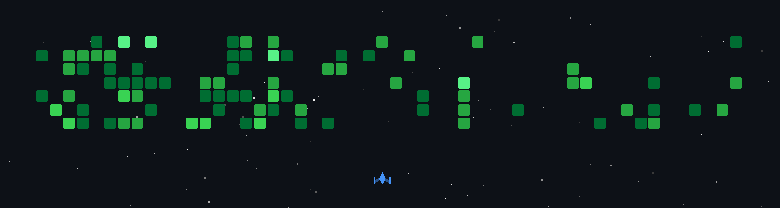

### 💫 About Me:
 `"Building, evolving, and learning—one commit at a time."`

> 💬 Ask me about anything.  
👯 I’m looking to collaborate on other software devs, app devs, or web devs to exchange, learn, and enhance my skills.  

## Currently learning:

#### Tech Stack:

  

<!---->
<!---->
<!---->
<!-- # 📊 GitHub Stats:
 
 

### 🌐 Socials:

 

### ✍️ Random Dev Quote
 -->

<!-- Proudly created with GPRM ( https://gprm.itsvg.in ) -->

## 💻 My Projects:

### 🔭 Currently working on these projects (Private):
> Note: some of these project are still in concept.

- **Loom** - A **Music player app** that utilizes Material 3 Design using Flutter for UI consistency among different platforms.  
- **Markly** - A **notes app**.  
- **Zealify** - A **Programming docset app** that puts programming documentation right in your pocket.
- **"Sinupan"** (Tagalog for "Archive" or "Place for keeping things") - A **Filipino Dialect Database app** aimed at the goal of preserving endangered Philippine languages and connecting native speakers through a shared digital archive of their unique cultural expressions. 
- **Iter** - is a mobile Flutter app that lets students write and run Flutter code in real-time to develop an intuition for mobile development through hands-on experimentation. And help understand the structure (widget tree) of using the framework.

